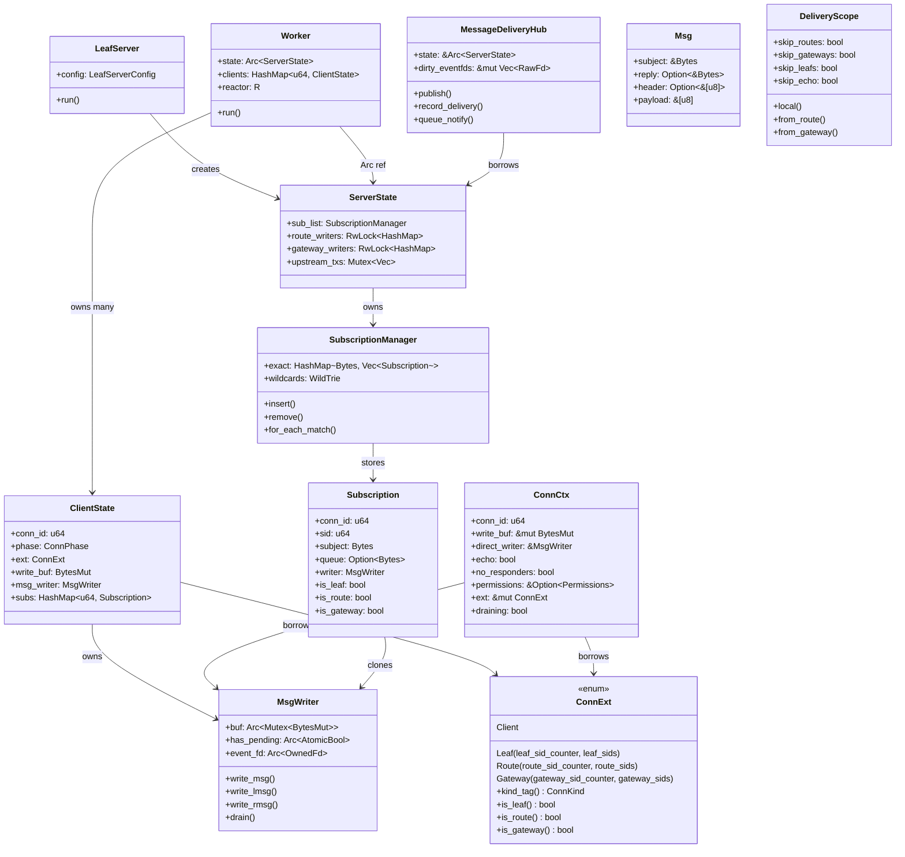
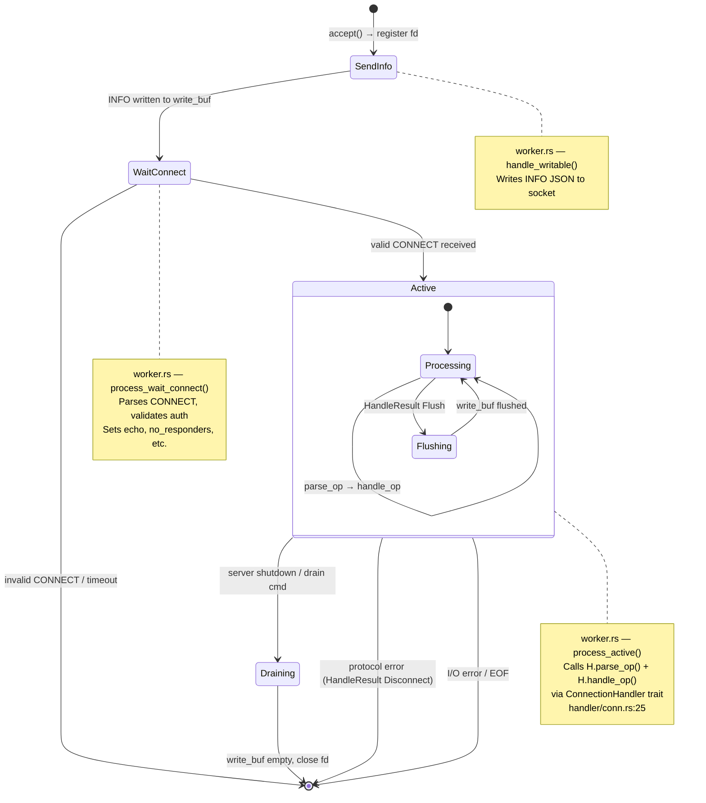
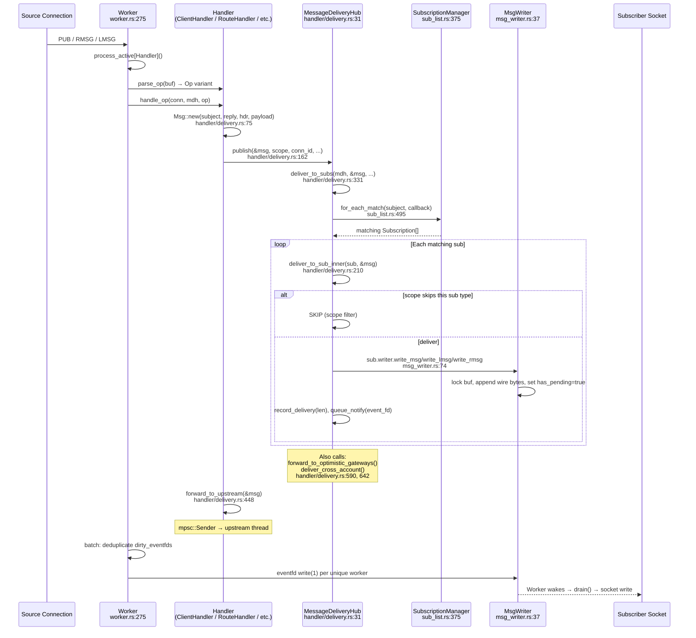
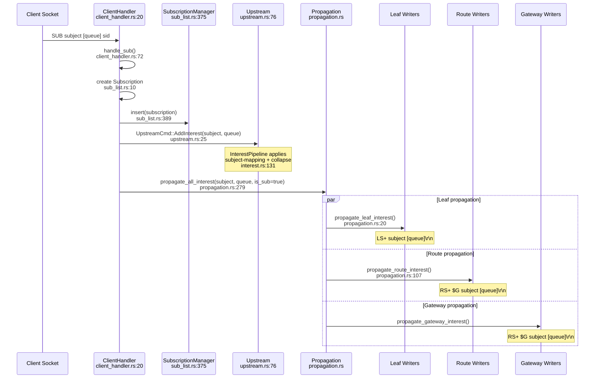
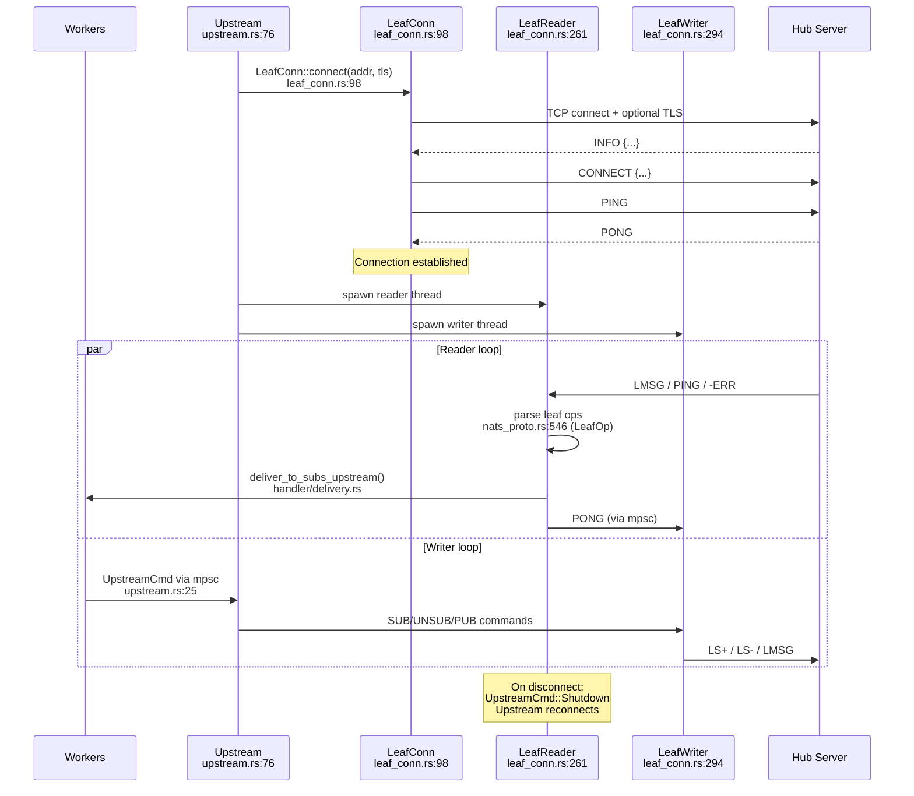
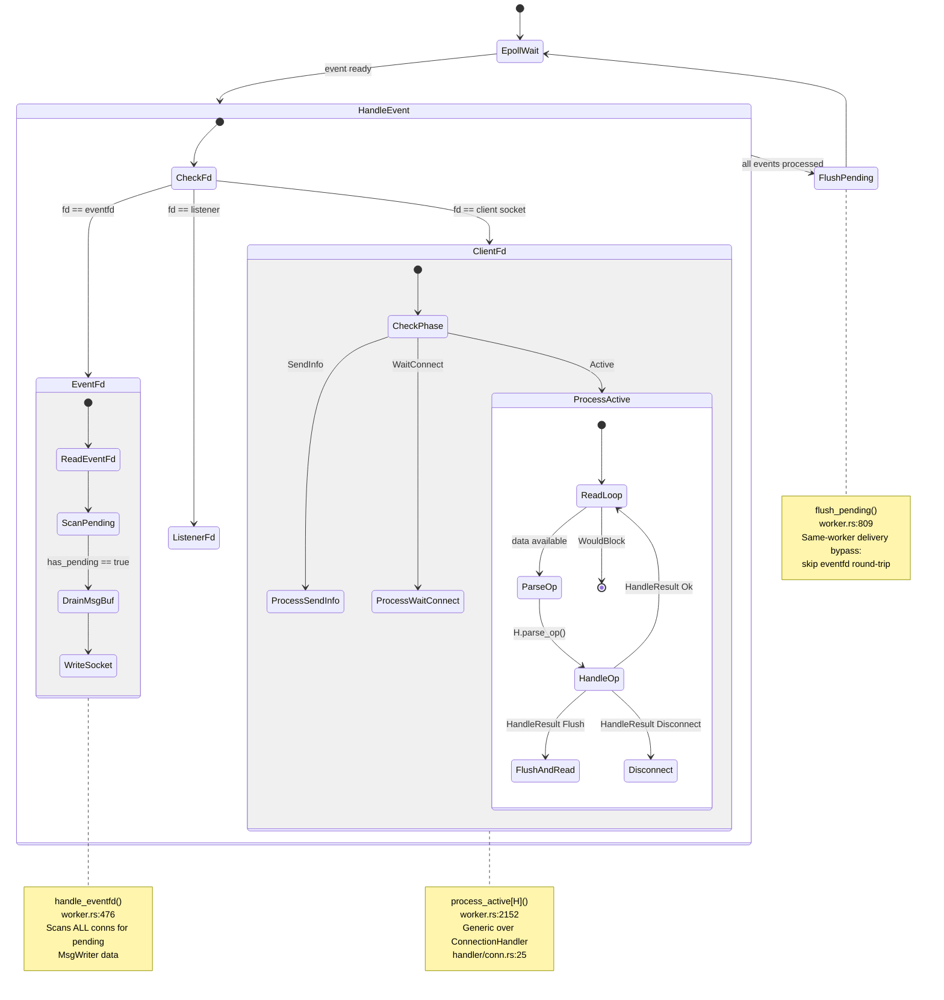
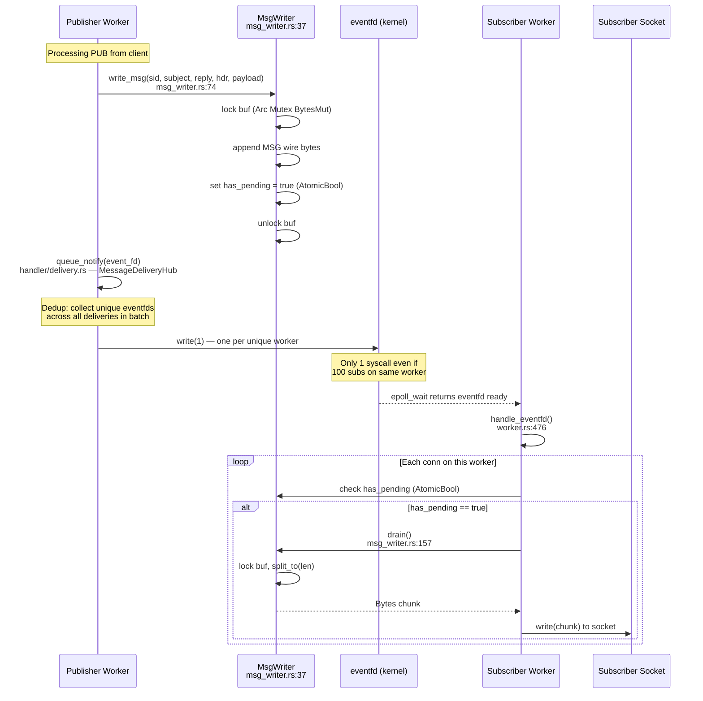
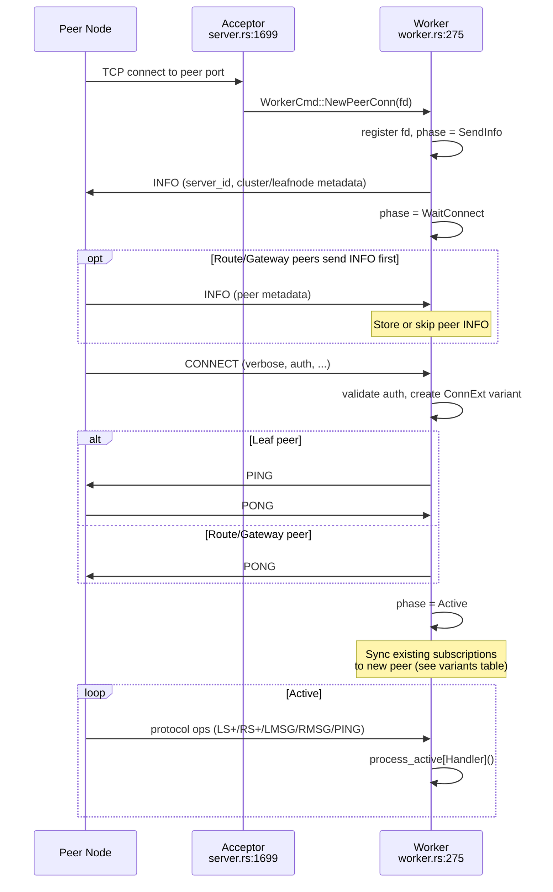
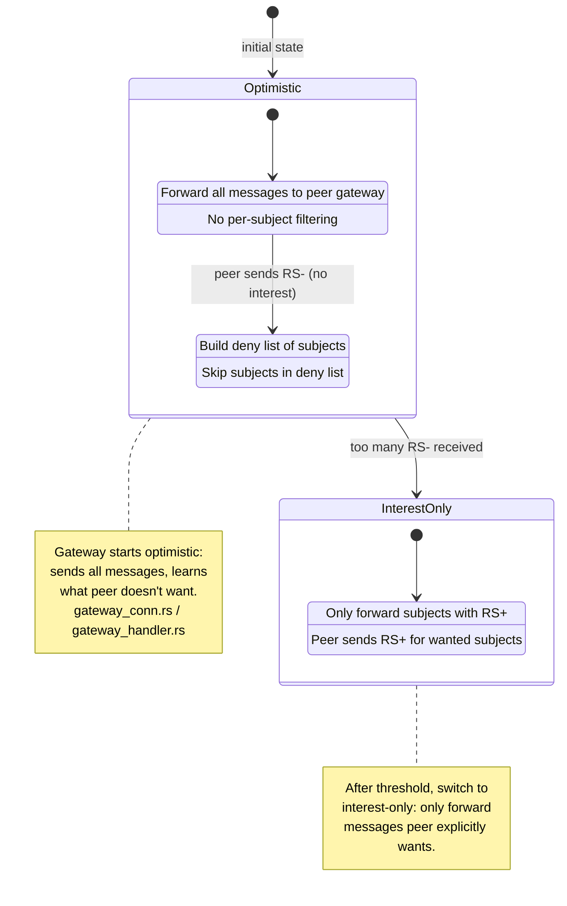

# Low-Level Design — open-wire

Interactive diagrams using Mermaid. Each diagram links types and methods
to source locations (`file:line`) so you can jump straight to the code.

---

## Table of Contents

1. [Type Relationships](#1-type-relationships)
2. [Connection Lifecycle State Machine](#2-connection-lifecycle-state-machine)
3. [Message Delivery Pipeline](#3-message-delivery-pipeline)
4. [Client SUB → Interest Propagation](#4-client-sub--interest-propagation)
5. [Upstream Leaf Connection Flow](#5-upstream-leaf-connection-flow)
6. [Worker Event Loop](#6-worker-event-loop)
7. [MsgWriter Cross-Worker Delivery](#7-msgwriter-cross-worker-delivery)
8. [Inbound Peer Handshake](#8-inbound-peer-handshake)
9. [Gateway Interest Modes](#9-gateway-interest-modes)

---

## 1. Type Relationships

Core structs and their ownership/reference relationships.

---

## 2. Connection Lifecycle State Machine

Every inbound connection (client, leaf, route, gateway) follows this
state machine in the worker event loop.

> [`ConnPhase`](../src/worker.rs#L178) — `worker.rs:178`

---

## 3. Message Delivery Pipeline

All message sources (client PUB, route RMSG, gateway RMSG, leaf LMSG)
share the same delivery pipeline. The common flow is shown once below,
with per-source differences captured in the scope variants table.

### Scope Variants

How `DeliveryScope` differs per message origin:

| Origin | Handler | DeliveryScope | Skips |
|--------|---------|---------------|-------|
| Client PUB | `ClientHandler` | `local(echo)` | echo if `!echo` |
| Route RMSG | `RouteHandler` | `from_route()` | route subs (one-hop rule) |
| Gateway RMSG | `GatewayHandler` | `from_gateway()` | route + gateway subs |
| Leaf LMSG | `LeafHandler` | `local(false)` | originating leaf |

---

## 4. Client SUB → Interest Propagation

When a client subscribes, interest is propagated to upstream, routes,
leafs, and gateways.

---

## 5. Upstream Leaf Connection Flow

The upstream module connects to a hub server using the leaf node protocol.

> [`Upstream`](../src/upstream.rs#L76) — `upstream.rs:76`
> [`LeafConn`](../src/leaf_conn.rs#L98) — `leaf_conn.rs:98`

---

## 6. Worker Event Loop

Each worker thread runs a tight epoll loop processing socket events
and cross-worker notifications.

> [`Worker::run()`](../src/worker.rs#L275) — `worker.rs:275`

---

## 7. MsgWriter Cross-Worker Delivery

How messages cross worker boundaries using shared buffers and eventfd.

> [`MsgWriter`](../src/msg_writer.rs#L37) — `msg_writer.rs:37`

---

## 8. Inbound Peer Handshake

All inbound peer connections (leaf, route, gateway) follow a common
handshake template. The worker accepts the connection, exchanges
INFO/CONNECT, creates the appropriate `ConnExt` variant, syncs existing
subscriptions, then enters the active protocol loop.

### Handshake Variants

| Peer Type | Port | ConnExt | Interest Sync | Handler | Protocol Ops |
|-----------|------|---------|---------------|---------|--------------|
| Leaf | `leafnode_port` | `Leaf { leaf_sid_counter, leaf_sids }` | `send_existing_subs()` (LS+) | `LeafHandler` | LS+/LS-/LMSG |
| Route | `cluster_port` | `Route { route_sid_counter, route_sids }` | `send_existing_route_subs()` (RS+) | `RouteHandler` | RS+/RS-/RMSG |
| Gateway | `gateway_port` | `Gateway { gateway_sid_counter, gateway_sids }` | `send_existing_route_subs()` (RS+) | `GatewayHandler` | RS+/RS-/RMSG |

---

## 9. Gateway Interest Modes

Gateways use two interest modes to optimize cross-cluster traffic.

---

## Source File Index

Quick reference linking diagram elements to source code.

| Type / Function | File | Line |
|---|---|---|
| `LeafServer` | `server.rs` | 1432 |
| `ServerState` | `server.rs` | 1094 |
| `Worker` | `worker.rs` | 275 |
| `ClientState` | `worker.rs` | 218 |
| `ConnPhase` | `worker.rs` | 178 |
| `process_active()` | `worker.rs` | 2152 |
| `flush_pending()` | `worker.rs` | 809 |
| `handle_eventfd()` | `worker.rs` | 476 |
| `ConnectionHandler` | `handler/conn.rs` | 25 |
| `ConnCtx` | `handler/conn.rs` | 46 |
| `ConnExt` | `handler/conn.rs` | 67 |
| `ConnKind` | `handler/conn.rs` | 97 |
| `HandleResult` | `handler/conn.rs` | 179 |
| `MessageDeliveryHub` | `handler/delivery.rs` | 31 |
| `Msg` | `handler/delivery.rs` | 75 |
| `DeliveryScope` | `handler/delivery.rs` | 104 |
| `MessageDeliveryHub::publish()` | `handler/delivery.rs` | 162 |
| `deliver_to_sub_inner()` | `handler/delivery.rs` | 210 |
| `deliver_to_subs_core()` | `handler/delivery.rs` | 258 |
| `deliver_to_subs()` | `handler/delivery.rs` | 331 |
| `forward_to_upstream()` | `handler/delivery.rs` | 448 |
| `handle_expired_subs()` | `handler/delivery.rs` | 503 |
| `forward_to_optimistic_gateways()` | `handler/delivery.rs` | 590 |
| `deliver_cross_account()` | `handler/delivery.rs` | 642 |
| `SubscriptionManager` | `sub_list.rs` | 375 |
| `Subscription` | `sub_list.rs` | 10 |
| `SubscriptionManager::insert()` | `sub_list.rs` | 389 |
| `SubscriptionManager::remove()` | `sub_list.rs` | 397 |
| `SubscriptionManager::for_each_match()` | `sub_list.rs` | 495 |
| `MsgWriter` | `msg_writer.rs` | 37 |
| `MsgWriter::write_msg()` | `msg_writer.rs` | 74 |
| `MsgWriter::write_lmsg()` | `msg_writer.rs` | 92 |
| `MsgWriter::write_rmsg()` | `msg_writer.rs` | 109 |
| `MsgWriter::drain()` | `msg_writer.rs` | 157 |
| `ClientOp` | `nats_proto.rs` | 153 |
| `LeafOp` | `nats_proto.rs` | 546 |
| `RouteOp` | `nats_proto.rs` | 838 |
| `MsgBuilder` | `nats_proto.rs` | 1194 |
| `try_parse_client_op()` | `nats_proto.rs` | 182 |
| `ClientHandler` | `client_handler.rs` | 20 |
| `handle_sub()` | `client_handler.rs` | 72 |
| `handle_pub()` | `client_handler.rs` | 281 |
| `LeafHandler` | `leaf_handler.rs` | 22 |
| `RouteHandler` | `route_handler.rs` | 21 |
| `GatewayHandler` | `gateway_handler.rs` | 23 |
| `Upstream` | `upstream.rs` | 76 |
| `UpstreamCmd` | `upstream.rs` | 25 |
| `LeafConn` | `leaf_conn.rs` | 98 |
| `LeafReader` | `leaf_conn.rs` | 261 |
| `LeafWriter` | `leaf_conn.rs` | 294 |
| `InterestPipeline` | `interest.rs` | 131 |
| `propagate_all_interest()` | `propagation.rs` | 279 |
| `propagate_leaf_interest()` | `propagation.rs` | 20 |
| `propagate_route_interest()` | `propagation.rs` | 107 |
